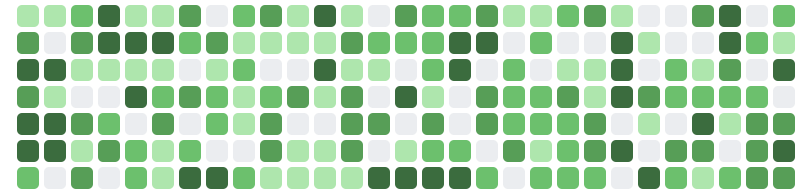
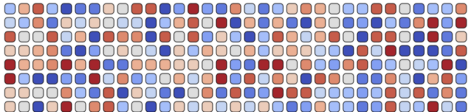
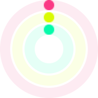
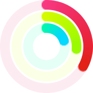
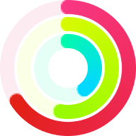
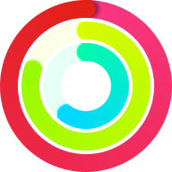
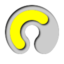

# Sparklines for macOS, iOS and tvOS

A lightweight sparkline component, supporting Swift, SwiftUI, macCatalyst and Objective-C.

<p align="center">
    
    
    
    
    
    
</p>

<p align="center">
    
    
    
    <a href="https://swift.org/package-manager">
        
    </a>
</p>

<center>
<a href="https://github.com/dagronf/dagronf.github.io/raw/master/art/projects/DSFSparkline/reportview.png">
</a>
</center>

## What is a sparkline?

A sparkline is a very small chart, typically drawn without axes or coordinates. It presents the general shape of the variation (typically over time) in some measurement, such as temperature or stock market price, in a simple and highly condensed way. Sparklines are small enough to be embedded in text, or several sparklines may be grouped together as elements of a small multiple. Whereas the typical chart is designed to show as much data as possible, and is set off from the flow of text, sparklines are intended to be succinct, memorable, and located where they are discussed.

[Source: Wikipedia](https://en.wikipedia.org/wiki/Sparkline)

## What ISN'T a sparkline?

`DSFSparkline` **IS NOT** designed to be a full-featured graphing library. It was built to be lightweight, to create small, memorable charts within an app.

If you need features like labelling, real-time updating, axis-labelling, interactivity, legends or beautiful charts at larger sizes, you might be better served by the [Charts library](https://github.com/danielgindi/Charts), [Core plot](https://github.com/core-plot/core-plot) or [SciChart (paid)](https://www.scichart.com/ios-chart-features/). You can find a whole lot more [here](https://iosexample.com/tag/charts/).

## Features

* Multiple graph styles support, such as line, bar, tablet etc.
* Support for sparkline customizations, such as zero-line, grid lines, highlighting.
* Prebuilt NSView/UIView/SwiftUI types for quick integration
* Independently scalable for sparklines at any size
* y-range can automatically grow or shrink to encompass the full y-range of data.
* y-range can be fixed and the sparkline will truncate to the specified range
* SwiftUI support for all sparkline types
* NSAttributedString support
* `IBDesignable` support for prebuilt types so you can see and configure your sparklines in interface builder.
* Optional drawing of a 'zero line' on the bar and line graphs (thanks [Tito Ciuro](https://github.com/tciuro))
* Playground support

## TL;DR - Show me something!

<details>
<summary>Create a retina-scale (144dpi) bitmap with a simple line overlay graph</summary>

```swift
// A datasource with a simple set of data
let source = DSFSparkline.DataSource(values: [4, 1, 8, 7, 5, 9, 3], range: 0 ... 10)

let bitmap = DSFSparklineSurface.Bitmap()   // Create a bitmap surface
let stack = DSFSparklineOverlay.Line()      // Create a line overlay
stack.dataSource = source                   // Assign the datasource to the overlay
bitmap.addOverlay(stack)                    // And add the overlay to the surface.

// Generate an image with retina scale
let image = bitmap.image(width: 50, height: 25, scale: 2)

// Embed a sparkline in an NSAttributedString
let attributedString = bitmap.attributedString(size: CGSize(width: 40, height: 18), scale: 2)
```


</details>

<details>
<summary>Create a Swift-UI line graph sparkline with zero-line and highlight range overlays</summary>

```swift
fileprivate let SwiftUIDemoDataSource: DSFSparkline.DataSource = {
   let d = DSFSparkline.DataSource(windowSize: 20, range: 0 ... 1, zeroLineValue: 0.5)
     d.push(values: [
        0.72, 0.84, 0.15, 0.16, 0.30, 0.58, 0.87, 0.44, 0.02, 0.27,
        0.48, 0.16, 0.15, 0.14, 0.81, 0.53, 0.67, 0.52, 0.07, 0.50
     ])
     return d
  }()

struct SuperCoolLineSpark: View {
   // The overlay representing the zero-line for the data source
   var zeroOverlay: DSFSparklineOverlay = {
      let zeroLine = DSFSparklineOverlay.ZeroLine()
      zeroLine.dataSource = SwiftUIDemoDataSource
      zeroLine.dashStyle = []
      return zeroLine
   }()

   // The overlay to draw a highlight between range 0 ..< 0.2
   var rangeOverlay: DSFSparklineOverlay = {
      let highlight = DSFSparklineOverlay.RangeHighlight()
      highlight.dataSource = SwiftUIDemoDataSource
      highlight.highlightRange = 0.0 ..< 0.2
      highlight.fill = DSFSparkline.Fill.Color(DSFColor.gray.withAlphaComponent(0.4).cgColor)
      return highlight
   }()

   // The actual line graph
   var lineOverlay: DSFSparklineOverlay = {
      let lineOverlay = DSFSparklineOverlay.Line()
      lineOverlay.dataSource = SwiftUIDemoDataSource

      lineOverlay.primaryStrokeColor = DSFColor.systemBlue.cgColor
      lineOverlay.primaryFill = DSFSparkline.Fill.Color(DSFColor.systemBlue.withAlphaComponent(0.3).cgColor)

      lineOverlay.secondaryStrokeColor = DSFColor.systemYellow.cgColor
      lineOverlay.secondaryFill = DSFSparkline.Fill.Color(DSFColor.systemYellow.withAlphaComponent(0.3).cgColor)

      lineOverlay.strokeWidth = 1
      lineOverlay.markerSize = 4
      lineOverlay.centeredAtZeroLine = true

      return lineOverlay
   }()

   var body: some View {
      DSFSparklineSurface.SwiftUI([
         rangeOverlay,    // range highlight overlay
         zeroOverlay,     // zero-line overlay
         lineOverlay,     // line graph overlay
      ])
      .frame(width: 150, height: 40)
   }
}
```


</details>

## Available graph types

### Line 

A simple line sparkline. The line can be centered around a zero line to indicate positive and negative values. You can also add (optional) markers to the data points.

You can custom-draw the markers by supplying a drawing callback block (`markerDrawingBlock`) where you can customize which markers are drawn (for example, just the min and max values) and how they are drawn.

|  Standard  | Centered  |
|------------|------------|
|||

|  Interpolated  | Interpolated Centered  |
|------------|------------|
|||

|  Standard Markers  | Interpolated Markers |
|------------|------------|
|||

|  Custom Markers (min/max only)  | Custom Markers (Last 5 values) |
|------------|------------|
|||

<details>
  <summary>Swift example using custom markers</summary>
  
```swift
//
// A custom marker drawing function that draws the maximum value in green, the minimum value in red
//
self.myLineView.markerDrawingBlock = { context, markerFrames in
   // Get the frames containing the minimum and maximum values
   if let minMarker = markerFrames.min(by: { (a, b) -> Bool in a.value < b.value }),
      let maxMarker = markerFrames.min(by: { (a, b) -> Bool in a.value > b.value }) {

      // Draw minimum marker

      context.setFillColor(DSFColor.systemRed.cgColor)
      context.fill(minMarker.rect)
      context.setLineWidth(0.5)
      context.setStrokeColor(DSFColor.white.cgColor)
      context.stroke(minMarker.rect)

      // Draw maximum marker

      context.setFillColor(DSFColor.systemGreen.cgColor)
      context.fill(maxMarker.rect)

      context.setLineWidth(0.5)
      context.setStrokeColor(DSFColor.white.cgColor)
      context.stroke(maxMarker.rect)
   }
}
```
</details>

### Bar 

A simple barchart sparkline. The bar can be centered around a zero line to indicate positive and negative values.

|  Standard  |  Centered  |
|------------|------------|
|||

### Stackline 

A stackline sparkline is similar to a bar chart except that it doesn't separate out individual columns. The stackline can be centered around a zero line to indicate positive and negative values.

|  Standard  |  Centered  |
|------------|------------|
|||

### Stripes 

A stripes graph.  A good example of a stripes graph is the 'warming stripes' [climate graph](https://www.climatecentral.org/showyourstripes).

Values from the datasource are mapped to a supplied gradient

|  Standard  |  Integral (pixel boundaries)  |
|------------|-------------------------------|
|||

### Dot 

A dot sparkline reminiscent of Activity Viewer's CPU history graphs

|  Standard  |  Inverted  |
|------------|------------|
|||

### Win/Loss/Tie 

A win-loss graph, where positive values in the datasource are represented as a 'win', negative values represented as a 'loss', and zero values are a 'tie'.

|  Win/Loss  |  Win/Loss/Tie  |
|------------|------------|
|||

### Tablet 

A tablet graph, where positive values in the datasource are represented as a filled circle, negative values represented as an unfilled circle. The behaviour is identical to the win/loss graph.

|  Standard  |
|------------|
||

### Pie 

A basic pie sparkline

|  Standard  |
|------------|
||

### DataBar 

A databar sparkline.  Supports percentage and totals types.

|  Percent  |  Total  |
|------------|------------|
|||

### PercentBar 

A percentbar sparkline takes a single value (0 ... 1) and draws a horizontal bar chart containing the value with an optional text label.

|    |    |
|------------|------------|
|||

### WiperGauge 

A simple gauge with a single value (0 ... 1). The color displayed in the gauge can be one of

* a single flat color
* a color mapped from a gradient to the value
* a color mapped from a color bucket to the value

|  Standard  |
|------------|
||

### Activity Grid 

A Github-style activity grid. Each cell represents a discrete value in a progression with a color

* Configurable horizontal/vertical cell count
* Configurable cell spacing
* Configurable fill schemes

|            |            |
|------------|------------|
|||

### Circular Progress    

A circular progress graph

* Configurable track width
* Optional track background color
* Configurable track padding to allow overlaying multiple progress graphs to replicate the health rings.
* Configurable fill schemes

| Simulated health rings |
|------------------------|
|&nbsp;&nbsp;&nbsp;|

### Circular Gauge    

A circular gauge

* Configurable track/line width
* Configurable fill/stroke schemes
* Supports shadows/inner shadows
* Animatable changes

|      |       |       |       |
|------|-------|-------|-------|
| <a href="./Art/doc/circular-gauge-basic.png"> </a> | <a href="./Art/doc/circular-gauge-inner-inout.png"> </a> | <a href="./Art/doc/circular-gauge-gradient.png"> </a> | <a href="./Art/doc/circular-gauge-slightly.png"> </a> |


# Demos

You can find a lot of examples of sparklines in projects in the `Demos/Samples` subfolder, providing examples for macOS (swift and objc), iO, tvOS, macCatalyst and SwiftUI.

There's also a simple Xcode Playground available in the `Demos/Playground` subfolder where you can play with the different sparkline types

# Building your sparkline

### Using prebuilt views

A prebuilt view is useful to quickly add a sparkline using SwiftUI or via Interface Builder. These views a slightly more limited set of styling and customizations but are much quicker to implement than using overlays directly.

For the most part, the prebuilt types will be all you need.

If you've used `DSFSparklines` prior to v4, these are the original view types that you used to display your sparklines.

* **A datasource** - the set of values to draw
* **A prebuilt view type** - the NSView/UIView/SwiftUI view to draw your sparkline

### Using overlays

There are three fundamental building blocks for an overlay sparkline. Overlay sparklines are more flexible and configurable than the pre-built views, but are more complex to set up.

* **A surface** - where it will draw
* **A datasource** - the set of values to draw
* **One or more overlays** - the 'layers' which render different components of the sparkline

## Surface

A surface represents a destination for a sparkline. This library provides a number of built-in surfaces

* `DSFSparklineSurfaceView` - An `NSView`/`UIView` surface for displaying a sparkline
* `DSFSparklineSurface.SwiftUI` - A SwiftUI `View` surface.
* `DSFSparklineSurface.Bitmap` - A `NSImage`/`UIImage`/`CGImage`/`NSAttributedString` surface for creating a bitmap from a sparkline.

## DataSource

A data source provides data for a sparkline. A datasource can be shared between multiple overlays or prebuilt types (see below) to provide different 'views' of the data contained within the source.  And if a `DataSource` is updated, all sparkline ovelays observing that source will be automatically re-rendered.

There are currently two types of datasource available

### DSFSparkline.DataSource

A DataSource that contains values that can be updated by pushing new values into the source.

<details>
  <summary>More details</summary>

#### WindowSize

The DataSource defines a 'windowSize' - the maximum number of values to be drawn on the overlay. As values are pushed into the DataSource, any values that no longer `fit` within the DataSource window are discarded.

* If the window size is reduced, stored data is truncated.
* If the window size is increased, the data store is padded with zeros

<details>
  <summary>Code example</summary>

```swift
/// Swift
dataSource.windowSize = 30
assert(dataSource.windowSize == 30)
```

```objective-c
/// Objective-C
[dataSource setWindowSize:30];
assert([dataSource windowSize] == 30);
```
</details>

#### Y-range

The range defines the upper and lower values to be displayed in the sparkline. Any values pushed into the datasource will be capped when drawn to this range.

If the range is not set (ie nil), then any overlays will automatically resize to fit the entire range of values within the source.  For example, with values as [1, 2, 3, 4] the range is implicitly set as 1 ... 4. If the values are [-10, 100, 33] the range is implicitly set as -10 ... 100

<details>
  <summary>Code example</summary>

```swift
/// Swift
dataSource.range = -1.0 ... 1.0
```

```objective-c
/// Objective-C
[dataSource setRangeWithLowerBound:-1.0 upperBound:1.0];
```
</details>

#### Zero-line value

The zero-line defines the point the sparkline overlays should consider to be 'zero'. For example, graphs that can be centered (line, bar and stackline) use the zero-line value to define where the graph is centered around.

The zero-line value defaults to zero.

You can draw a zero-line for a sparkline by adding a `DSFSparklineOverlay.ZeroLine` to your surface.

<details>
  <summary>Code example</summary>

```swift
/// Swift
dataSource.zeroLineValue = 0.2
```

```objc
/// Objective-C
[dataSource setZeroLineValue:0.2];
```
</details>

#### Adding values

You can push new values into the datasource using the `push` functions. Values in the datasource older than the datasource's `windowSize` are discarded.  

As values are pushed into the datasource, any overlays assigned this datasource will automatically update.

<details>
  <summary>Code example</summary>

```swift
/// Swift
dataSource.push(value: 4.5)
dataSource.push(values: [6, 7, 8])
```

```objective-c
/// Objective-C
[dataSource pushWithValue:@(4.5)];
```
</details>

You replace all the values in a datasource the `set` functions. The set function also changes the `windowSize` for the datasource to the size of the values array passed in.

Any overlays assigned this datasource will automatically update.

<details>
  <summary>Code example</summary>

```swift
/// Swift
datasource.set(values: [
   0.0, 0.1, 0.2, 0.3, 0.4, 0.5, 0.6, 0.7, 0.8, 0.9, 1.0,
   0.0, -0.1, -0.2, -0.3, -0.4, -0.5, -0.6, -0.7, -0.8, -0.9, -1.0
])
```

```objc
/// Objective-C
[datasource setWithValues:
   @[@(0.0), @(0.1), @(0.2), @(0.3), @(0.4), @(0.5), @(0.6), @(0.7), @(0.8), @(0.9), @(1),
     @(0.0), @(-0.1), @(-0.2), @(-0.3), @(-0.4), @(-0.5), @(-0.6), @(-0.7), @(-0.8), @(-0.9), @(-1)]];
```

</details>


</details>

### DSFSparkline.StaticDataSource

A datasource that contains a static set of values. Some types of sparkline use a single 'set' of data, providing no historical context.

<details>
  <summary> More details </summary>

```swift
/// Swift
let dataSource = DSFSparkline.StaticDataSource([1, 2, 3])
```

```objc
/// Objective-C
DSFSparklineStaticDataSource* dataSource = [[DSFSparklineStaticDataSource alloc] init: @[@(1), @(2), @(3)]];
```

</details>

## Overlays

Overlays represent the individual visual components of a sparkline. You can add as many or as few to your surface in any order. For example, you could overlay two different graph types onto the same surface using the same. And as overlays can share their datasource, all overlays using the same source will automatically update if the data changes (for example, in reponse to a `push`)

For example, there is an overlay that highlights a y-range of data. Or, if you want some grid lines, you can add them using the gridlines overlay.

You can add different instances of an overlay to the same sparkline. For example, if you want to add multiple range highlights you add multiple 'highlight' overlays to the sparkline surface.

The order in which the overlays are added determine where in the z-order that they appear in the sparkline.  For example, you can choose to draw the grid on top of the graph if you want by adding the graph overlay BEFORE you add the grid overlay

<center></center>

The overlay allows your sparkline to be as complex or as simple as you want.

### Graph types

#### Dynamic

A dynamic graph automatically updates its overlays as values are 'pushed' onto its datasource. As data is added the assigned overlay is automatically updated to reflect the new data.  If more data is added via a push or set the data is added to the datasource, the associated view will automatically update to reflect the new data. Older data that no longer falls within the datasource window is discarded.

This provides the ability to show a historical data set over the breadth of the graph.

<details>
  <summary>`DSFSparklineOverlay.Line`  </summary>
  
```swift
let bitmap = DSFSparklineSurface.Bitmap()   // Create a bitmap surface
let line = DSFSparklineOverlay.Line()      // Create a line overlay
line.strokeWidth = 1
line.primaryFill = primaryFill
line.dataSource = source                   // Assign the datasource to the overlay
bitmap.addOverlay(line)                    // And add the overlay to the surface.

// Generate an image with retina scale
let image = bitmap.image(width: 50, height: 25, scale: 2)!

// Do something with 'image'
```
</details>

<details>
  <summary>`DSFSparklineOverlay.StackLine` </summary>
  
```swift
let bitmap = DSFSparklineSurface.Bitmap()    // Create a bitmap surface
let stack = DSFSparklineOverlay.Stackline()  // Create a stackline overlay
stack.dataSource = source                    // Assign the datasource to the overlay
stack.strokeWidth = 1
stack.primaryFill = primaryFill
bitmap.addOverlay(stack)                     // And add the overlay to the surface.

// Generate an image with retina scale
let image = bitmap.image(width: 50, height: 25, scale: 2)!

// Do something with 'image'
```
</details>

<details>
  <summary>`DSFSparklineOverlay.Bar` </summary>
  
```swift
let bitmap = DSFSparklineSurface.Bitmap()   // Create a bitmap surface
let bar = DSFSparklineOverlay.Bar()         // Create a bar overlay
bar.dataSource = source                     // Assign the datasource to the overlay
bar.primaryFill = primaryFill
bitmap.addOverlay(bar)                      // And add the overlay to the surface.

// Generate an image with retina scale
let image = bitmap.image(width: 50, height: 25, scale: 2)!

// Do something with 'image'
```
</details>

<details>
  <summary>`DSFSparklineOverlay.Dot` </summary>
  
```swift
let bitmap = DSFSparklineSurface.Bitmap()  // Create a bitmap surface
let dot = DSFSparklineOverlay.Dot()        // Create a dot graph overlay
dot = biggersource                         // Assign the datasource to the overlay
bitmap.addOverlay(dot)                     // And add the overlay to the surface.

// Generate an image with retina scale
let image = bitmap.image(width: 50, height: 32, scale: 2)!

// Do something with 'image'
```
</details>


<details>
  <summary>`DSFSparklineOverlay.WinLossTie` </summary>
  
```swift
let bitmap = DSFSparklineSurface.Bitmap()          // Create a bitmap surface
let winLossTie = DSFSparklineOverlay.WinLossTie()  // Create a win-loss-tie overlay
winLossTie.dataSource = winloss                    // Assign the datasource
bitmap.addOverlay(winLossTie)                      // And add the overlay to the surface.

// Generate an image with retina scale
let image = bitmap.image(width: 75, height: 12, scale: 2)!

// Do something with 'image'
```
</details>

<details>
  <summary>`DSFSparklineOverlay.Tablet` </summary>
  
```swift
let bitmap = DSFSparklineSurface.Bitmap()    // Create a bitmap surface
let stack = DSFSparklineOverlay.Tablet()     // Create a tablet overlay
stack.dataSource = winloss                   // Assign a datasource to the overlay
bitmap.addOverlay(stack)                     // And add the overlay to the surface.

// Generate an image with retina scale
let image = bitmap.image(width: 90, height: 16, scale: 2)!

// Do something with 'image'
```
</details>


<details>
  <summary>`DSFSparklineOverlay.Stripes` </summary>
  
```swift
let bitmap = DSFSparklineSurface.Bitmap()    // Create a bitmap surface
let stack = DSFSparklineOverlay.Stripes()    // Create a stripes overlay
stack.dataSource = .init(values: [0, 1, 2, 3, 4, 5, 6, 7, 8, 9, 10])
bitmap.addOverlay(stack)                     // And add the overlay to the surface.

// Generate an image with retina scale
let image = bitmap.image(width: 90, height: 16, scale: 2)

// Do something with 'image'
```
</details>


#### Static

A static graph has a fixed set of values (for example, a pie chart). The overlays update when a new static data source is assigned to it.

<details>
  <summary>`DSFSparklineOverlay.Pie` </summary>
  
```swift
let bitmap = DSFSparklineSurface.Bitmap()
let pie = DSFSparklineOverlay.Pie()
pie.dataSource = DSFSparkline.StaticDataSource([10, 55, 20])
pie.lineWidth = 0.5
pie.strokeColor = CGColor.black

bitmap.addOverlay(pie)

// Generate an image with retina scale
let image = bitmap.image(width: 18, height: 18, scale: 2)!

// Do something with 'image'
```
</details>

<details>
  <summary>`DSFSparklineOverlay.DataBar` </summary>
  
```swift
let bitmap = DSFSparklineSurface.Bitmap()
let stack = DSFSparklineOverlay.DataBar()
stack.dataSource = DSFSparkline.StaticDataSource([10, 20, 30])
stack.lineWidth = 0.5
stack.strokeColor = CGColor.black

bitmap.addOverlay(stack)

// Generate an image with retina scale
let image = bitmap.image(width: 50, height: 18, scale: 2)!

// Do something with 'image'
```
</details>

<details>
  <summary>`DSFSparklineOverlay.PercentBar`   </summary>
  
```swift
let bitmap = DSFSparklineSurface.Bitmap()
let percentBar = DSFSparklineOverlay.PercentBar(value: 0.3)

bitmap.addOverlay(percentBar)

// Generate an image with retina scale
let image = bitmap.image(width: 50, height: 18, scale: 2)!

// Do something with 'image'
```

</details>

<details>
  <summary>`DSFSparklineOverlay.WiperGauge` </summary>
  
```swift
let bitmap = DSFSparklineSurface.Bitmap()
let wiperGauge = DSFSparklineOverlay.WiperGauge()
wiperGauge.value = 0.75

bitmap.addOverlay(wiperGauge)

// Generate an image of the wiper gauge with retina scale
let image = bitmap.image(width: 50, height: 25, scale: 2)

// Do something with 'image'
```

</details>

<details>
  <summary>`DSFSparklineOverlay.ActivityGrid` </summary>
  
```swift
let bitmap = DSFSparklineSurface.Bitmap()
let activityGrid = DSFSparklineOverlay.ActivityGrid()
activityGrid.dataSource = DSFSparkline.StaticDataSource(values: [...])
activityGrid.verticalCellCount = 1

bitmap.addOverlay(activityGrid)

// Generate an image of the wiper gauge with retina scale
let image = bitmap.image(width: 200, height: 14, scale: 2)

// Do something with 'image'
```

</details>

<details>
  <summary>`DSFSparklineOverlay.CircularGauge` </summary>
  
```swift
let bitmap = DSFSparklineSurface.Bitmap()
let gauge = DSFSparklineOverlay.CircularGauge()
gauge.value = 0.66

bitmap.addOverlay(gauge)

// Generate an image of the wiper gauge with retina scale
let image = bitmap.image(width: 40, height: 40, scale: 2)

// Do something with 'image'
```

</details>

### Component types

A component represents an overlay that isn't a graph in itself.  Examples are grid lines, zero-lines, highlights etc.  A component uses the same datasource so that it aligns with the graph it is associated with.

|  Name  | Description  |
|------------|------------|
| `DSFSparklineOverlay.ZeroLine` | Draw a horizontal line at the 'zero-line' position of the sparkline. The zero-line is defined by the datasource and is by default zero, however this can be changed. |
| `DSFSparklineOverlay.RangeHighlight` | Highlight a range of y-values on the sparkline |
| `DSFSparklineOverlay.GridLines` | Draw lines at specified y-values on the sparkline |

## Using prebuilt views

DSFSparkline has a number of 'prebuilt' sparkline views available with a more limited scope, designed to be quicker to add to your project.

Every prebuilt sparkline view has a SwiftUI companion view.

### Available prebuilt types

* `DSFSparklineLineGraphView` / `DSFSparklineLineGraphView.SwiftUI`
* `DSFSparklineStackLineGraphView` / `DSFSparklineLineGraphView.SwiftUI`
* `DSFSparklineBarGraphView` / `DSFSparklineBarGraphView.SwiftUI`
* `DSFSparklineStripesGraphView` / `DSFSparklineStripesGraphView.SwiftUI`
* `DSFSparklineDotGraphView` / `DSFSparklineDotGraphView.SwiftUI`
* `DSFSparklineWinLossGraphView` / `DSFSparklineWinLossGraphView.SwiftUI`
* `DSFSparklineTabletGraphView` / `DSFSparklineTabletGraphView.SwiftUI`
* `DSFSparklinePieGraphView` / `DSFSparklinePieGraphView.SwiftUI`
* `DSFSparklineDataBarGraphView` / `DSFSparklineDataBarGraphView.SwiftUI`
* `DSFSparklinePercentBarGraphView` / `DSFSparklinePercentBarGraphView.SwiftUI`
* `DSFSparklineWiperGaugeGraphView` / `DSFSparklineWiperGaugeGraphView.SwiftUI`
* `DSFSparklineActivityGridView` / `DSFSparklineActivityGridView.SwiftUI`
* `DSFSparklineCircularGaugeView` / `DSFSparklineCircularGaugeView.SwiftUI`

<details>
  <summary>Sample Swift code</summary>
 
```swift

// Create the view
let sparklineView = DSFSparklineLineGraphView(…)
sparklineView.graphColor = UIColor.blue
sparklineView.showZeroLine = true

// Create the datasource and assign to the view
let sparklineDataSource = DSFSparklineDataSource(windowSize: 30, range: -1.0 ... 1.0)
sparklineView.dataSource = sparklineDataSource

…

// Add a single new data element to the sparkline
sparklineDataSource.push(value: 0.7)                          // view automatically updates with new data

// Add a set of data to the sparkline
sparklineDataSource.push(values: [0.3, -0.2, 1.0])            // view automatically updates with new data

// Completely replace the sparkline data with a new set of data
sparklineDataSource.set(values: [0.2, -0.2, 0.0, 0.9, 0.8])   // view automatically resets to new data

```
  
</details>

<details>
  <summary>Sample SwiftUI code</summary>
  
```swift
struct SparklineView: View {

   let leftDataSource: DSFSparkline.DataSource
   let rightDataSource: DSFSparkline.DataSource
   
   let BigCyanZeroLine = DSFSparkline.ZeroLineDefinition(
      color: .cyan,
      lineWidth: 3,
      lineDashStyle: [4,1,2,1]
   )
   
   var body: some View {
      HStack {
         DSFSparklineLineGraphView.SwiftUI(
            dataSource: leftDataSource,
            graphColor: DSFColor.red,
            interpolated: true)
         DSFSparklineBarGraphView.SwiftUI(
            dataSource: rightDataSource,
            graphColor: DSFColor.blue,
            lineWidth: 2,
            showZeroLine: true,
            zeroLineDefinition: BigCyanZeroLine)
      }
   }
}
```

<a href="https://github.com/dagronf/dagronf.github.io/raw/master/art/projects/DSFSparkline/swifui.png"></a>

</details>


<details>
<summary>Prebuilt customizations</summary>

## View Types and settings

Represents the viewable settings and display.  The current view types available are :-

### Common display customizations

| Setting               | Type                   | Description                                             |
|-----------------------|------------------------|---------------------------------------------------------|
| `graphColor`          | `NSColor`<br>`UIColor` | The color to use when drawing the sparkline             |

#### Common elements for graphs that can display a zero line (Line/Bar/Stackline)

| Setting               | Type                    | Description                                             |
|-----------------------|-------------------------|---------------------------------------------------------|
| `dataSource`          | `DSFDataSource`         | The source of data for the graph                        |
| `showZeroLine`        | `Bool`                  | Draw a dotted line at the zero line point on the y-axis |
| `zeroLineColor`       | `NSColor`<br/>`UIColor` | The color of the 'zero line' on the y-axis.             |
| `zeroLineWidth`       | `CGFloat`               | The width of the 'zero line' on the y-axis              |
| `zeroLineDashStyle`   | `[CGFloat]`             | The dash pattern to use when drawing the zero line      |

#### Common elements for graphs that can be centered around the zero-line (Line/Bar/Stackline)

| Setting               | Type                    | Description                                                                               |
|-----------------------|-------------------------|-------------------------------------------------------------------------------------------|
| `centeredAtZeroLine`  | `Bool`                  | Should the graph be centered at the zero line? |
| `lowerGraphColor`     | `NSColor`<br/>`UIColor` | The color used to draw values below the zero line. If nil, is the same as the graph color |

### Line graph customizations (`DSFSparklineLineGraphView`)

| Setting           | Type            | Description                      |
|-------------------|-----------------|----------------------------------|
| `dataSource`      | `DSFDataSource` | The source of data for the graph |
| `lineWidth`       | `CGFloat`       | The width of the line            |
| `interpolation`   | `Bool`          | Interpolate a curve between the points |
| `lineShading`     | `Bool`          | Shade the area under the line |
| `shadowed`        | `Bool`          | Draw a shadow under the line |
| `markerSize`      | `CGFloat`       | (optional) Draw a marker of the specified size at every data point in the graph using the line color at that point |
| `markerSize`      | `CGFloat`       | (optional) Draw a marker of the specified size at every data point in the graph using the line color at that point |
| `markerDrawingBlock` | | A callback block to allow custom drawing of markers (if `markerSize` is > 1) |

### Bar graph customizations (`DSFSparklineBarGraphView`)

| Setting      | Type            | Description                      |
|--------------|-----------------|----------------------------------|
| `dataSource` | `DSFDataSource` | The source of data for the graph |
| `lineWidth`  | `CGFloat`       | The width of the line            |
| `barSpacing` | `CGFloat`       | The spacing between each bar     |

### Stripes graph customizations (`DSFSparklineStripesGraphView`)

| Setting      | Type            | Description                                                         |
|--------------|-----------------|---------------------------------------------------------------------|
| `dataSource` | `DSFDataSource` | The source of data for the graph                                    |
| `integral`   | `Bool`          | If true, draws the bars on pixel boundaries to get nice clean lines |
| `gradient`   | `DSFGradient`   | The color gradient to use when mapping datasource values to colors. |

### Dot graph customizations (`DSFSparklineDotGraphView`)

| Setting           | Type                   | Description                                        |
|-------------------|------------------------|----------------------------------------------------|
| `dataSource`      | `DSFDataSource`        | The source of data for the graph                   |
| `upsideDown`      | `Bool`                 | If true, draws from the top of the graph downwards |
| `unsetGraphColor` | `NSColor`<br>`UIColor` | The color to use when drawing the background       |

### Win/Loss graph customizations (`DSFSparklineWinLossGraphView`)

| Setting        | Type                   | Description                       |
|----------------|------------------------|-----------------------------------|
| `dataSource`   | `DSFDataSource`        | The source of data for the graph  |
| `lineWidth`    | `CGFloat`              | The line width for the stroke     |
| `barSpacing`   | `CGFloat`              | The spacing between each bar      |
| `winColor`     | `NSColor`<br>`UIColor` | The color to use for a 'win'      |
| `lossColor`    | `NSColor`<br>`UIColor` | The color to use for a 'loss'     |
| `tieColor`     | `NSColor`<br>`UIColor` | *(optional)* The color to use for a 'tie'. If nil, tie (0) values are not drawn<br>By default, 'tie' values are not drawn. |

### Tablet graph customizations (`DSFSparklineTabletGraphView`)

| Setting      | Type                   | Description                                      |
|--------------|------------------------|--------------------------------------------------|
| `dataSource` | `DSFDataSource`        | The source of data for the graph                 |
| `lineWidth`  | `CGFloat`              | The line width for the stroke                    |
| `barSpacing` | `CGFloat`              | The spacing between each bar                     |
| `winColor`   | `NSColor`<br>`UIColor` | The color to draw the filled circle for a 'win'  |
| `lossColor`  | `NSColor`<br>`UIColor` | The color to draw the filled circle for a 'loss' |

### Pie graph customizations (`DSFSparklinePieGraphView`)

| Setting             | Type                   | Description                                                                             |
|---------------------|------------------------|-----------------------------------------------------------------------------------------|
| `dataSource`        | `[CGFloat]`            | The data to display in the pie chart                                                    |
| `palette`           | `DSFSparklinePalette`  | The palette to use when drawing the chart                                               |
| `strokeColor`       | `NSColor`<br>`UIColor` | (optional) The color of the line to draw between each segment. If nil, no line is drawn |
| `lineWidth`         | `CGFloat`              | The width of the lines to draw between each segment                                     |
| `animated`          | `Bool`                 | If true, when the data source is set the segments animate into view                     |
| `animationDuration` | `CGFloat `             | The duration of the animation                                                           |

### Databar graph customizations (`DSFSparklineDataBarGraphView`)

| Setting             | Type                   | Description                                                                                                            |
|---------------------|------------------------|------------------------------------------------------------------------------------------------------------------------|
| `dataSource`        | `[CGFloat]`            | The data to display in the pie chart                                                                                   |
| `maximumTotalValue` | `CGFloat`              | If <= 0 the data represents a percentage of the total, if > 0 represents the rightmost value to the databar            |
| `palette`           | `DSFSparklinePalette`  | The palette to use when drawing.                                                                                       |
| `strokeColor`       | `NSColor`<br>`UIColor` | (optional) The color of the line to draw between each segment. If nil, no line is drawn                                |
| `lineWidth`         | `CGFloat`              | The width of the lines to draw between each segment                                                                    |
| `unsetColor`        | `NSColor`<br>`UIColor` | (optional) If the maximum value is set, if the segments don't fit the total this color is used as the background color |
| `animated`          | `Bool`                 | If true, when the data source is set the segments animate into view                                                    |
| `animationDuration` | `CGFloat`              | The duration of the animation                                                                                          |

### Percent Bar graph customizations (`DSFSparklinePercentBarGraphView`)

| Setting             | Type                   | Description                                                                                                            |
|---------------------|------------------------|--------------------------------------------------------|
| `value`        | `CGFloat`            | The value to display in the pie chart |
| `displayStyle` | `Style` | The style to apply when drawing the graph |
| `cornerRadius`           | `CGFloat`  | The corner radius for the bar. |
| `showLabel` | `Bool` | Should we draw a text label on the percent bar? |
| `underBarColor` | `NSColor`<br>`UIColor` | The background of the bar color for the percent bar chart |
| `underBarTextColor` | `NSColor`<br>`UIColor` | The color for text displayed on the background |
| `barColor` | `NSColor`<br>`UIColor` | The bar color for the percent bar chart |
| `barTextColor` | `NSColor`<br>`UIColor` | The color for text displayed on the bar |
| `fontName` | `String` | The name of the label font |
| `fontSize` | `CGFloat` | The size of the label font  |
| `shouldAnimate` | `Bool` | If true, when the data source is set the segments animate into view |
| `animationDuration` | `CGFloat` | The duration of the animation |
| `leftInset`.  | `CGFloat` | The bar's inset from the left of the control |
| `topInset`    | `CGFloat` | The bar's inset from the top of the control |
| `rightInset`  | `CGFloat` | The bar's inset from the right of the control |
| `bottomInset` | `CGFloat` | The bar's inset from the bottom of the control |

</details>

## Integration

There are demos available in the `Demos` subfolder for each of the supported platforms.  The demos use CocoaPods so you'll need to `pod install` in the Demos folder.

### Import the library into your source files

#### Cocoapods

`pod 'DSFSparkline', :git => 'https://github.com/dagronf/DSFSparkline/'`

#### Swift package manager

Add `https://github.com/dagronf/DSFSparkline` to your project.

## Screenshots

### In app

| macOS dark | macOS light | iOS |
|----|----|----|
|  |  |  |

### Interface Builder

| macOS | tvOS |
|----|----|
|<a href="https://github.com/dagronf/dagronf.github.io/raw/master/art/projects/DSFSparkline/DSFSparkline_interfacebuilder.png"></a>|<a href="https://github.com/dagronf/dagronf.github.io/raw/master/art/projects/DSFSparkline/DSFSparkline_interfacebuilder-2.png"></a>|

### SwiftUI

<a href="https://github.com/dagronf/dagronf.github.io/raw/master/art/projects/DSFSparkline/SwiftUI1.jpg"></a>

### NSAttributedString support


### Animated


## Changes

### `6.0.0`

* Added CircularGauge, CircularProgress sparkline types
* Removed support for `@IBDesignable` and `@IBInspectable` from the NSView/UIView implementations, as Xcode has
  indicated that it will be dropping support in the near future

### `5.2.0`

* Added grid-lines support for pre-built views (line, bar, stack) (NSView/UIView/SwiftUI)

### `5.1.0`

* Added Activity Grid

### `5.0.0`

* Fixed [occasional clipping](https://github.com/dagronf/DSFSparkline/issues/13) on interpolated line graphs.

### `4.6.0`

* Added WiperGauge sparkline type

### `4.3.0`

* Added the ability to custom-draw markers for the 'line' sparkline type [(raised issue)](https://github.com/dagronf/DSFSparkline/issues/6)
* Fixed a minor issue where insetting certain graph types to remove clipping (line with markers, bar) would mean that zeroline, highlight overlays and grids would be appear to be very slightly off.

### `4.2.0`

* Added 'percent bar' sparkline type.

### `4.1.2`

* Fixed compile issue [Cannot find type 'NSTextAttachment' in scope" crashes when using SwiftPackage](https://github.com/dagronf/DSFSparkline/issues/5)

### `4.1.1`

* Fixed gradient bucket count issue. 
* Added AttributedString SwiftUI demo to the ReportView demo. Demo uses [The SwiftUI Lab Attributed String](https://swiftui-lab.com/attributed-strings-with-swiftui/) with AppKit bug fix for width calculation.

### `4.1.0`

* Embed sparklines in NSAttributedString.

### `4.0.0`

Substantial re-architect of the drawing code (that used to be directly in the views) into overlays and surfaces that are far more flexible (for example, being able to draw a sparkline bitmap without having to create a view)

The previous view/swiftui types are still available - they have been rebuilt on using the new overlay scheme and are referred to in documentation as 'prebuilt' types. This allowed backwards compatibility with previous versions of the library.  Note however that given that the prebuilt views have been re-written there is a possibility of slight visual differences.

### `3.7.0`

* Added stripe graph

### `3.6.1`

* Fixed animations on iOS/tvOS

### `3.6.0`

* Added pie chart, databar chart.
* Added ability to show data markers for line graphs

### `3.5.2`

* Fixed Objective-C Demo app
* Added `snapshot` method to the base sparkline view class to produce an NSImage/UIImage version of the sparkline for embedded sparklines in text etc.

### `3.5.1`

* Fixed version in podspec

### `3.5.0`

* Added stackline sparkline type
* Added win/loss/tie sparkline type
* Added tablet sparkline type

### `3.4.0`

* Added support for centering line and bar graphs around their zero-line value.

### `3.3.0`

* Fixed issue where iOS background wasn't being drawn correctly in some cases.
* Fixed rare crash where a line graph with < 2 points would crash.

### `3.2.0`

* Changed the zero-line definition class to `DSFSparklineZeroLineDefinition` for clarity.
* More documentation, especially around SwiftUI. Attempted to make the documentation clearer around drawing parameters.

### `3.1.0`

* Add the ability to customize the zero-line display ([Tito Ciuro](https://github.com/tciuro))
* Changed `showZero` to `showZeroLine` for consistency with the new zero-line display values

### `3.0.0`

* Add the ability to set the 'zero' line value. Defaults to zero for backwards compatibility.

You can set where the 'zero' line draws via the `zeroLineValue` on the datasource.

### `2.0.0`

* The primary views have been renamed with a `View` postfix. So

   `DSFSparklineLineGraph` -> `DSFSparklineLineGraphView`
   
   `DSFSparklineBarGraph` -> `DSFSparklineBarGraphView`
   
   `DSFSparklineDotGraph` -> `DSFSparklineDotGraphView`

* Renamed `SLColor` and `SLView` to `DSFColor` and `DSFView` for module naming consistency.

* I removed `windowSize` from the core `DSFSparklineDataSourceView`. `windowSize` is related to data, and should never have been part of the UI definition.  I've provided a replacement purely for `IBDesignable` support called `graphWindowSize` which should only be called from Interface Builder.  If you want to set the windowSize from your xib file, set the `graphWindowSize` inspectable.

	If you see warnings in the log like 
`2020-12-07 18:22:51.619867+1100 iOS Sparkline Demo[75174:1459637] Failed to set (windowSize) user defined inspected property on (DSFSparkline.DSFSparklineBarGraphView): [<DSFSparkline.DSFSparklineBarGraphView 0x7fe2eb10f2b0> setValue:forUndefinedKey:]: this class is not key value coding-compliant for the key windowSize.
`
it means that you have a `windowSize` value set in your .xib file.  Remove it and set the `graphWindowSize` value instead.

* For the Bar type, `lineWidth` and `barSpacing` now represent the pixel spacing between bars and the pixel width for the line.  You may find that your line spacing and bar spacing are now incorrect if you have set fractional values for these in the past (for example, if you set lineWidth = 0.5).  The reason for this change is to aid drawing lines on pixel boundaries and avoid antialiasing.

* Fix for zero line being upside-down

## License

MIT. Use it for anything you want, just attribute my work. Let me know if you do use it somewhere, I'd love to hear about it!

```
MIT License

Copyright (c) 2023 Darren Ford

Permission is hereby granted, free of charge, to any person obtaining a copy
of this software and associated documentation files (the "Software"), to deal
in the Software without restriction, including without limitation the rights
to use, copy, modify, merge, publish, distribute, sublicense, and/or sell
copies of the Software, and to permit persons to whom the Software is
furnished to do so, subject to the following conditions:

The above copyright notice and this permission notice shall be included in all
copies or substantial portions of the Software.

THE SOFTWARE IS PROVIDED "AS IS", WITHOUT WARRANTY OF ANY KIND, EXPRESS OR
IMPLIED, INCLUDING BUT NOT LIMITED TO THE WARRANTIES OF MERCHANTABILITY,
FITNESS FOR A PARTICULAR PURPOSE AND NONINFRINGEMENT. IN NO EVENT SHALL THE
AUTHORS OR COPYRIGHT HOLDERS BE LIABLE FOR ANY CLAIM, DAMAGES OR OTHER
LIABILITY, WHETHER IN AN ACTION OF CONTRACT, TORT OR OTHERWISE, ARISING FROM,
OUT OF OR IN CONNECTION WITH THE SOFTWARE OR THE USE OR OTHER DEALINGS IN THE
SOFTWARE.
```
